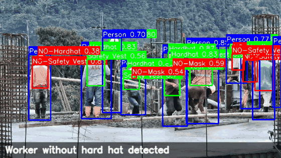

# SiteWatch — Construction Site Safety Monitor

A computer vision system for real-time construction site safety monitoring.
Built for **CSCI435 — Computer Vision Algorithms and Systems**, University of Wollongong in Dubai, Spring 2026.

SiteWatch ingests live camera or recorded footage from a construction site and continuously flags safety violations: workers without hard hats or safety vests, workers in proximity to moving machinery, and unattended hazards. Violations are overlaid on the video with bounding boxes, surfaced as a critical-alert banner, and logged with timestamps to a CSV for later review.

---

## Demo



A 5-second clip from `tests/fixtures/demo.mp4` processed through the live pipeline at 640 long edge. Green boxes are PPE-compliant detections (`Hardhat`, `Safety Vest`); red are violations (`NO-Hardhat`, `NO-Safety Vest`, `NO-Mask`); blue are workers; the bottom banner shows the highest-priority active alert.

---

## Computer vision capabilities

SiteWatch integrates four distinct CV capabilities into a single pipeline:

| Capability | Implementation | Purpose |
|---|---|---|
| Image enhancement | CLAHE on LAB color space, optional bilateral denoise | Normalises harsh outdoor lighting and dust before detection |
| Object detection | YOLOv8n (pre-trained COCO baseline) + YOLOv8m custom fine-tuned on construction safety dataset, merged with IoU-based deduplication | Detects workers, PPE compliance, machinery, vehicles, and safety cones |
| Shape detection | HoughCircles (hard-hat confirmation) + HoughLines/HSV (safety cones) | Cross-validates YOLO detections with classical CV |
| Motion / change detection | MOG2 background subtraction + binary morphological operations | Flags moving machinery; raises alerts when workers approach machinery zones |

The motion module additionally satisfies the brief's "binary morphological operations" capability through its `cv2.morphologyEx` open-then-close cleanup of the foreground mask.

---

## Architecture

```
Camera / upload  →  Streamlit frontend  →  CV pipeline  →  Decision fusion  →  Visual overlay + CSV log
                                          ↓
                          [enhance → detect → shapes → motion]
```

See the report for the full architecture diagram.

---

## Quickstart

### Prerequisites
- Python 3.10 or newer
- A working webcam (for live mode) — built-in laptop camera is fine
- ~2 GB free disk space for models and dependencies

### Install

```bash
git clone https://github.com/<your-username>/sitewatch.git
cd sitewatch
python -m venv .venv
source .venv/bin/activate          # macOS / Linux
.venv\Scripts\activate             # Windows PowerShell
pip install -r requirements.txt
```

#### Optional: GPU acceleration

`requirements.txt` pulls the CPU-only PyTorch wheel by default, which works everywhere but limits the live tab to ~3–5 FPS. If you have an NVIDIA GPU with CUDA drivers installed, replace the torch install with the matching CUDA wheel for a ~10× speed-up:

```bash
pip uninstall -y torch torchvision torchaudio
pip install torch torchvision --index-url https://download.pytorch.org/whl/cu124
```

(Adjust `cu124` to match your installed CUDA version — see [PyTorch's install matrix](https://pytorch.org/get-started/locally/). The reported benchmarks below were measured on the CUDA 12.4 build.)

### Run

```bash
streamlit run app.py
```

The app opens in your default browser at `http://localhost:8501`. If encountering errors, make sure to run the streamlit within the .venv you created by activating it following the steps mentioned before.

- **Live monitoring tab**: grant camera access; the system processes your webcam feed in real time.
- **Review footage tab**: upload a `.jpg`, `.png`, `.mp4`, or `.avi` file for offline analysis.

The custom fine-tuned YOLOv8m weights (`models/sitewatch_best.pt`) are bundled with the repository, so PPE classes (`Hardhat`, `NO-Hardhat`, `Safety Vest`, etc.) work immediately. The COCO YOLOv8n baseline (`models/yolov8n.pt`) is auto-downloaded on first detector init. To re-train the custom model from scratch, see "Training the custom model" below.

---

## Training the custom model

The custom YOLO is fine-tuned on the **Construction Site Safety Image Dataset** from Roboflow (2,801 images, 25 classes including the 10 safety classes plus machinery / vehicle subtypes). Training the YOLOv8m configuration takes ~60–90 minutes on a free Google Colab T4 GPU.

1. Open `training/train_yolo.ipynb` in Google Colab
2. Enable T4 GPU (Runtime → Change runtime type → T4)
3. Replace `YOUR_ROBOFLOW_API_KEY` with your free Roboflow account key
4. Run all cells — the notebook downloads the dataset, fine-tunes YOLOv8m for up to 200 epochs (with `patience=30` early stopping), validates, and produces `best.pt`
5. Download `best.pt` and place it at `models/sitewatch_best.pt`
6. Restart the Streamlit app — custom detections will now activate

Validation results from our training run are summarised in the Performance section below; the full per-class breakdown and training curves are in the project report.

---

## Project structure

```
sitewatch/
├── app.py                    # Streamlit entry point
├── cv_pipeline/              # The four CV capabilities
│   ├── enhancement.py        # CLAHE + denoise
│   ├── detection.py          # YOLO wrapper (COCO + custom)
│   ├── shapes.py             # Hough-based shape validation
│   ├── motion.py             # MOG2 + morphology + proximity
│   └── fusion.py             # Decision fusion + prioritised alerts
├── utils/                    # Drawing, benchmarking
├── training/train_yolo.ipynb # Colab fine-tuning notebook
├── models/                   # YOLO weights (COCO + custom)
├── tests/                    # Pytest suite
├── logs/                     # Auto-generated violation logs
└── benchmarks/               # Auto-generated performance reports
```

---

## Performance

Benchmarks on a Windows 11 laptop with an NVIDIA GeForce RTX 4060 Laptop GPU (8 GB VRAM), CUDA 12.4 PyTorch build, measured on the bundled `tests/fixtures/demo.mp4` (4K source, 30 sec, 900 frames). The custom backbone is `yolov8m` fine-tuned on the Construction Site Safety dataset.

| Metric | Live tab (640 long edge) | Review tab (1280 long edge) |
|---|---|---|
| Average FPS (whole pipeline) | 11.68 | 5.40 |
| Total latency p50 / p95 | 64.5 / 77.6 ms | 131.7 / 221.0 ms |
| Detection latency p50 / p95 | 48.0 / 60.6 ms | 67.3 / 115.6 ms |

Custom YOLOv8m validation results (114 val images, 733 instances):

| Metric | Value |
|---|---|
| mAP@0.5 | 0.563 |
| mAP@0.5–0.95 | 0.400 |
| Precision / Recall | 0.755 / 0.482 |
| Hardhat mAP@0.5 | 0.741 |
| NO-Hardhat mAP@0.5 | 0.578 |
| Safety Vest mAP@0.5 | 0.696 |
| NO-Safety Vest mAP@0.5 | 0.630 |
| Person mAP@0.5 | 0.766 |
| Safety Cone mAP@0.5 | 0.884 |
| machinery mAP@0.5 | 0.761 |

To reproduce: `python -m utils.benchmark tests/fixtures/demo.mp4 --max-long 640`. The `--max-long` flag mirrors the review-tab `_resize_long_edge` in `app.py`; pass `0` to benchmark at native resolution.

---

## Tests

```bash
pytest
```

The test suite covers each pipeline module with smoke tests against a fixture image.

---

## Limitations and future work

The current prototype operates on a single camera feed and produces immediate, rule-based alerts. Aggregating observations across multiple cameras and over time would enable a temporal risk model that estimates incident likelihood per zone in real time, allowing supervisors to intervene before a near-miss occurs. Other directions include integration with site access systems to gate entry on PPE compliance, multi-camera worker tracking, and edge deployment on Raspberry Pi or Jetson Nano hardware. See the report for a fuller discussion.

---

## Credits

- **Dataset**: [Construction Site Safety Image Dataset](https://universe.roboflow.com/roboflow-universe-projects/construction-site-safety) by Roboflow Universe Projects, used under the dataset's open license.
- **YOLOv8**: [Ultralytics YOLOv8](https://github.com/ultralytics/ultralytics) (AGPL-3.0)
- **OpenCV**: [opencv.org](https://opencv.org/)
- **Streamlit + streamlit-webrtc**: [streamlit.io](https://streamlit.io/), [whitphx/streamlit-webrtc](https://github.com/whitphx/streamlit-webrtc)

---

## Authors

| Name | Student ID | Role |
|---|---|---|
| Hani Moustafa | 8960215 | Lead Developer & Project Manager |
| [Teammate 2] | [ID] | [Role] |
| [Teammate 3] | [ID] | [Role] |
| [Teammate 4] | [ID] | [Role] |

CSCI435 — Spring 2026 — Dr. Patrick Mukala

---

## License

Original source code in this repository is released under the MIT License — see [`LICENSE`](LICENSE) for the full text. Bundled and referenced components (Ultralytics YOLOv8 under AGPL-3.0, the Roboflow Construction Site Safety dataset, the COCO dataset) remain subject to their own licenses; the `LICENSE` file enumerates them. Submitted as coursework for CSCI435 at UOWD.